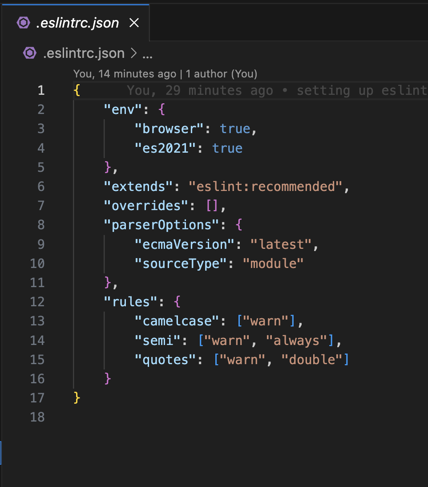
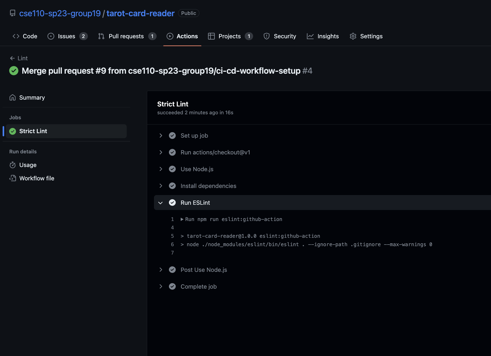
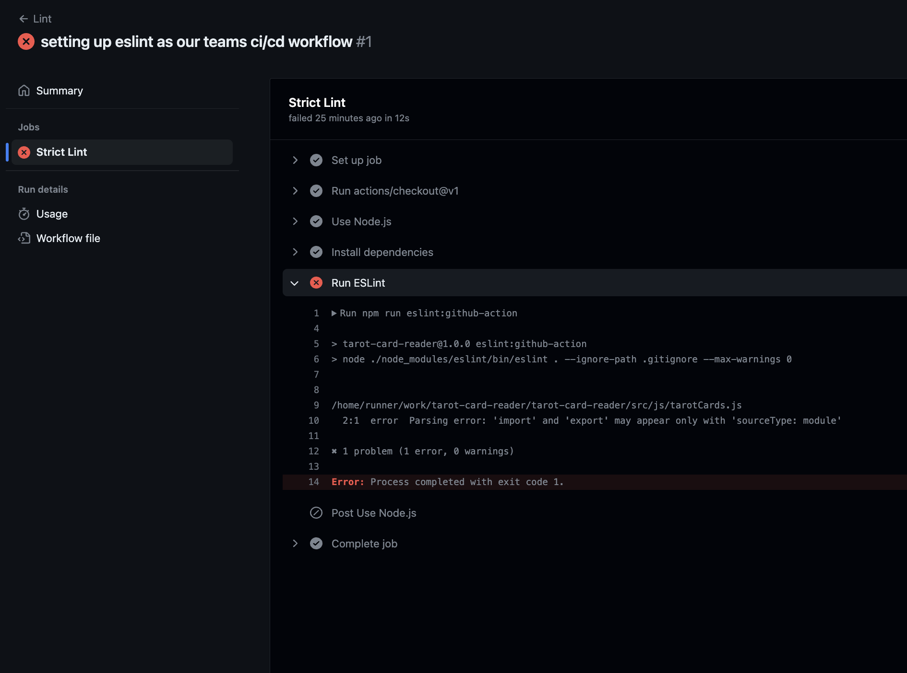
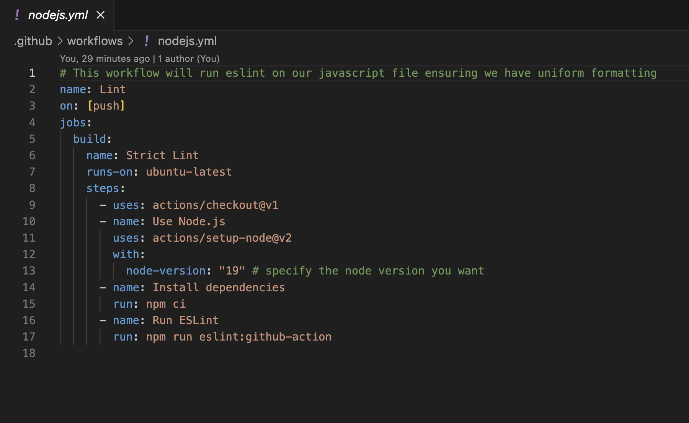
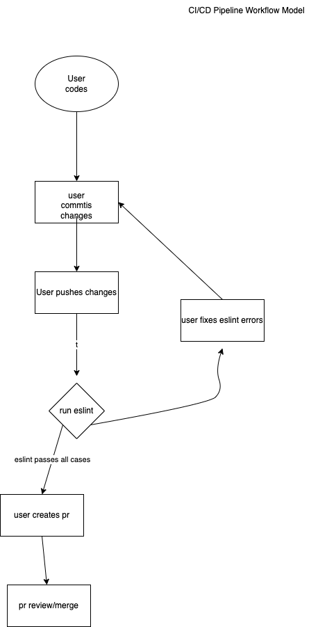

## Description

Linting and code style enforcement, code quality tools, human code reviews, unit tests automation, and documentation generation automation are all essential practices in software development for maintaining code quality, readability, and reliability.

**Linting and Code Style Enforcement**: Linting is the process of analyzing code to detect and report potential errors, bugs, and coding style violations. It involves using tools like ESLint, JSLint, or TSLint to enforce a consistent code style and catch common programming mistakes. Code style enforcement ensures that the code follows a defined set of coding conventions, enhancing readability and maintainability.

**Pros:**
- Enforces a consistent coding style, improving code readability and maintainability.
- Catches common programming mistakes and potential errors.
- Provides immediate feedback during development, allowing for quick fixes.
- Supports a team-wide coding standard, enhancing collaboration and code consistency.

**Cons:**
- Strict linting rules may lead to rigid coding practices that limit developer flexibility.
- Configuring and maintaining linting rules can be time-consuming.
- False positives or false negatives may occur, requiring manual review and adjustment of rules.
- May not catch all types of coding errors or logical flaws.

**Linting Example**
Here we are setting up the linting

Linting pass case

Linting fail case

Using github actions

**Code Quality via Tools**: Code quality tools, such as Codeclimate, Codacy, or SonarQube, analyze the codebase to assess various aspects of code quality, including complexity, maintainability, test coverage, and potential bugs or vulnerabilities. These tools provide automated checks and generate reports or metrics, helping developers identify areas for improvement and maintain a high level of code quality.

**Pros:**
- Provides automated checks and metrics to assess code quality.
- Identifies potential bugs, vulnerabilities, and areas for improvement.
- Offers insights into code complexity, maintainability, and test coverage.
- Facilitates continuous monitoring and improvement of code quality.

**Cons:**
- Automated tools may generate false positives or miss certain code quality issues.
- Requires configuration and setup, which may be time-consuming initially.
- Metrics and reports provided by the tools may require interpretation and analysis.
- Does not replace the need for human code reviews and critical thinking.

**Code Quality via Human Review**: Human code reviews, commonly conducted through pull requests, involve manual inspection and review of code by other developers. Code reviews provide an opportunity for collaboration, knowledge sharing, and catching errors that automated tools might miss. They help maintain code quality by ensuring adherence to coding standards, identifying logical flaws, and improving overall code quality through feedback and discussions.

**Pros:**
- Provides a deeper understanding and contextual knowledge of the codebase.
- Encourages collaboration, knowledge sharing, and learning opportunities.
- Offers a fresh perspective and different insights from other developers.
- Allows for discussions and feedback, leading to better code quality and best practices.

**Cons:**
- Can be time-consuming, especially for larger codebases or busy development teams.
- Subjective opinions and personal biases may influence the review process.
- Relies on the availability and expertise of reviewers.
- May introduce delays in the development process if not properly managed.

**Unit Tests via Automation**: Unit tests are automated tests that verify the behavior of individual components or units of code. Various testing frameworks like Jest, Mocha/Chai, or Cypress enable developers to write and execute unit tests automatically. Unit tests help catch regressions, validate expected behavior, and ensure code correctness, enhancing the stability and reliability of the software.

**Pros:**
- Ensures code correctness and behavior through automated tests.
- Helps catch regressions and validate expected outcomes.
- Provides confidence in code changes and refactoring.
- Supports a test-driven development (TDD) approach and reduces manual testing efforts.

**Cons:**
- Requires additional time and effort to write and maintain unit tests.
- May not cover all possible scenarios or edge cases.
- False negatives may occur if tests are not comprehensive or robust.
- Can lead to slower development cycles if tests are time-consuming to run.

**Documentation Generation via Automation**: Documentation generation automation involves tools like JSDoc, Doxygen, or Sphinx, which extract code comments and annotations to generate documentation automatically. By embedding documentation directly within the codebase, developers can maintain up-to-date and consistent documentation, improving code understanding, collaboration, and onboarding processes.

**Pros:**
- Generates up-to-date and consistent documentation directly from code annotations.
- Facilitates code understanding, collaboration, and onboarding processes.
- Reduces manual documentation efforts and ensures documentation accuracy.
- Enables easy maintenance and updates as code changes.

**Cons:**
- Relies on developers consistently adding and maintaining code comments and annotations.
- Generated documentation may lack context and narrative structure.
- May not capture complex or non-obvious relationships and dependencies.
- Requires a learning curve for understanding and configuring the documentation generation tool.

**Pipeline Diagram**
Here is what our initial CI pipeline will look like

